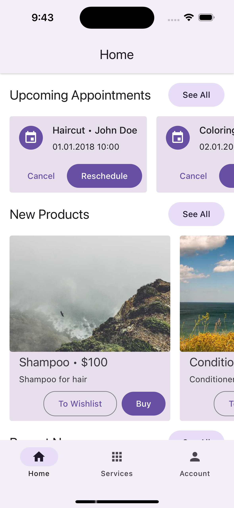
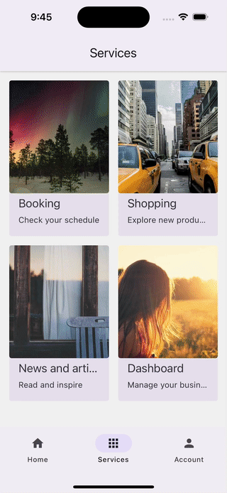
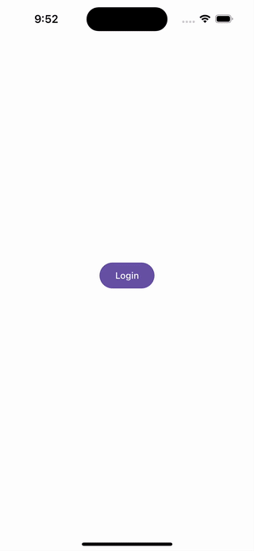

<a href="https://www.callstack.com/open-source?utm_campaign=generic&utm_source=github&utm_medium=referral&utm_content=super-app-showcase" align="center">
  
</a>
<h3 align="center">Super Apps in React Native with Re.Pack</h3>
<div align="center">

[![mit licence][license-badge]][license]
[![Chat][chat-badge]][chat]
[![PRs Welcome][prs-welcome-badge]][prs-welcome]

</div>

Bring micro-frontend architecture to your mobile [React Native](https://reactnative.dev) app with [Re.Pack](https://re-pack.dev) and make it a Super App. [Learn more.](https://www.callstack.com/services/super-app-development?utm_campaign=super_apps&utm_source=github&utm_content=super_app_showcase)

## The problem

As small apps grow, offering multiple services (payments, messaging, social network, gaming, news, etc.), maintaining them becomes challenging. The codebase can become cluttered, and the app size may deter users who only need a few services. Today, teams dealing with such a challenge can either use monorepo to help draw the boundaries between functionalities, or leverage publishing and consuming packages from npm. However, both approaches have their drawbacks. At the same time, web teams have acccess to micro-frontend architecture, which allows them to split the app into smaller, more manageable parts downloadable on demand.

## The solution

This showcase demonstrates how to achieve a proper micro-frontend architecture for mobile apps with [Module Federation](https://module-federation.io). It simplifies setup and maintenance, allowing independent apps to be deployed separately or as part of a super app. Micro-frontends can be moved to separate repositories, enabling independent team work or external contributions. Unlike classic monorepos, this setup uses runtime dependencies, so updating a micro-frontend automatically updates all apps using it without redeployment.

## The Super App

<table>
  <tr>
    <td>Host App</td>
    <td>Mini Apps Interaction</td>
    <td>Booking Standalone App</td>
  </tr>
  <tr>
    <td></td>
    <td></td>
    <td></td>
  </tr>  
</table>

## Structure


This monorepo contains the host and a shared SDK; the mini apps live in **separate repositories** and are loaded at runtime as Module Federation remotes:

- `host` (`packages/host`) - the main app, which is a super app. It loads the mini apps as remotes and provides navigation between them. It registers each remote in [`packages/host/rspack.config.ts`](packages/host/rspack.config.ts).
- `sdk` (`packages/sdk`) - shared dependency management and utilities consumed by the host and the remotes.
- `booking` - micro-frontend for the booking service. External remote served on **port 9000**, repo https://github.com/m0hamadreza/booking.
- `news` - micro-frontend for the news service. External remote served on **port 9004**, repo https://github.com/m0hamadreza/news.

The external remotes are cloned as **siblings** of this repo and, by default, served as prebuilt **static bundles** (view-only) so you can run the super app without their dev servers. When you want to edit one, run its dev server instead. See [`docs/external-remotes.md`](docs/external-remotes.md) for the full details.

```
development/
├── superApp/   ← this repo (host + sdk)
├── booking/    ← external remote (separate repo)
└── news/       ← external remote (separate repo)
```

## How to use

### Requirements

⚠️ **Important:** This project requires:

- Node.js version 22 or higher
- pnpm as package manager

Please refer to the official [pnpm installation guide](https://pnpm.io/installation) for detailed setup instructions.

After installation, it's recommended to align your pnpm version with the project:

```bash
pnpm self-update
```

### Setup

Install the host/SDK dependencies:

```
pnpm install
```

Clone and pre-build the external remotes (`booking` and `news`) as siblings of this repo. This clones each one (or `git pull` if already present), installs it, and builds a static Module Federation bundle into `<repo>/build/generated/<platform>`:

```
pnpm setup:remotes                 # both remotes, android (default)
pnpm setup:remotes --only news     # just one
pnpm setup:remotes --platform ios  # iOS bundles
```

Re-run `pnpm setup:remotes` whenever a remote ships changes — a `git pull` alone won't update the static bundle the app loads.

#### iOS

In case automatic pods installation doesn't work when running iOS project, you can install manually:

```
pnpm pods
```

### Running the Super App

Start the host and serve the remotes. By default both remotes are served **view-only** as static bundles:

```
pnpm start
```

To develop a remote with live reload (HMR), start it as a dev server instead of the static bundle:

```
pnpm dev:news       # news = dev server, booking = static
pnpm dev:booking    # booking = dev server, news = static
pnpm dev:both       # both = dev servers
```

Run the Super App on iOS or Android (ios | android):

```
pnpm run:host:<platform>
```

### Code Quality Scripts

Run tests for all apps:

```
pnpm test
```

Run linter for all apps:

```
pnpm lint
```

Run type check for all apps:

```
pnpm typecheck
```

## Contributing

Read the [contribution guidelines](/CONTRIBUTING.md) before contributing.

## Made with ❤️ at Callstack

Super App showcase is an open source project and will always remain free to use. If you think it's cool, please star it 🌟. [Callstack][callstack-readme-with-love] is a group of React and React Native geeks, contact us at [hello@callstack.com](mailto:hello@callstack.com) if you need any help with these or just want to say hi!

<!-- badges -->

[callstack-readme-with-love]: https://callstack.com/?utm_source=github.com&utm_medium=referral&utm_campaign=super-app-showcase&utm_term=readme-with-love
[license-badge]: https://img.shields.io/github/license/callstack/super-app-showcase?style=for-the-badge
[license]: https://github.com/callstack/super-app-showcase/blob/main/LICENSE
[prs-welcome-badge]: https://img.shields.io/badge/PRs-welcome-brightgreen.svg?style=for-the-badge
[prs-welcome]: ./CONTRIBUTING.md
[chat-badge]: https://img.shields.io/discord/426714625279524876.svg?style=for-the-badge
[chat]: https://discord.gg/Q4yr2rTWYF
